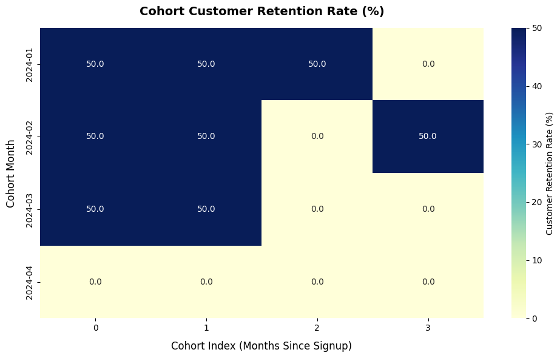

# Cohort LTV Analysis using Python & Pandas

## 📌 Project Overview
This project analyzes customer retention and Customer Lifetime Value (LTV) using cohort analysis techniques in Python.

The objective was to understand:

- How customer behavior changes over time
- Which cohorts retain value longer
- How retention impacts long-term revenue
- Differences in customer value across acquisition periods

The project combines Python-based data analysis with visual storytelling to better understand customer lifecycle behavior.

---

## 🌍 Dataset Context
This project was built using a transactional ecommerce dataset containing customer purchase behavior across multiple time periods.

The dataset was used to simulate real-world customer analytics workflows involving retention analysis, cohort tracking, and lifetime value measurement.

---

## 🛠 Tools Used
- Python
- Pandas
- Matplotlib
- Jupyter Notebook
- GitHub

---

## ⚙️ Data Challenges Solved
- Cleaned and transformed transactional customer data
- Created cohort groups based on customer acquisition month
- Calculated customer retention across time periods
- Built Customer Lifetime Value (LTV) calculations
- Structured cohort-level analysis for trend visualization

---

## 📊 Visual Insights

### Cohort Customer Retention Heatmap
Shows customer retention behavior across different cohorts over time, helping identify which customer groups retained activity longer after their first purchase.

---

### LTV Trend by Cohort
Tracks how Customer Lifetime Value (LTV) changes across cohorts over time, highlighting differences in long-term customer value and revenue contribution.

---

## 🔍 Key Business Insights

### 1. Customer Behavior Varied Across Cohorts
Different customer groups showed different retention and revenue patterns over time.

### 2. Retention Strongly Influenced Long-Term Value
Cohorts with better retention generated stronger Customer Lifetime Value (LTV).

### 3. Early Customer Drop-Off Impacted Revenue Potential
Some cohorts showed rapid decline after initial acquisition, reducing long-term customer value.

### 4. Smaller Cohorts Sometimes Generated Higher Long-Term Value
Not all high-volume cohorts performed best over time, highlighting the importance of customer quality over quantity.

---

## 📌 Business Recommendations
- Focus on improving early customer retention after first purchase
- Identify acquisition channels bringing higher-value customers
- Track cohort performance regularly instead of only total revenue
- Build retention campaigns targeting early drop-off behavior
- Prioritize long-term customer value alongside acquisition growth

---

## 📁 Files Included
- Python analysis notebook
- Cohort retention analysis
- LTV calculations
- Visualization outputs
- README summary

---

## 💡 Skills Demonstrated
- Python Data Analysis
- Pandas
- Cohort Analysis
- Customer Lifetime Value (LTV)
- Data Cleaning
- Retention Analytics
- Business Analytics
- Data Visualization
- Analytical Thinking

---

## 👤 Author
**Sarthi Khator**  
Transitioning into Data Analytics with hands-on experience in SQL, Python, Power BI, and business-focused problem solving.
